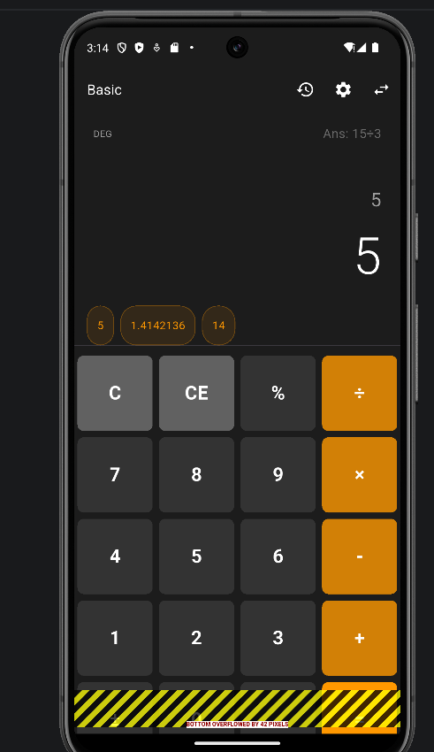
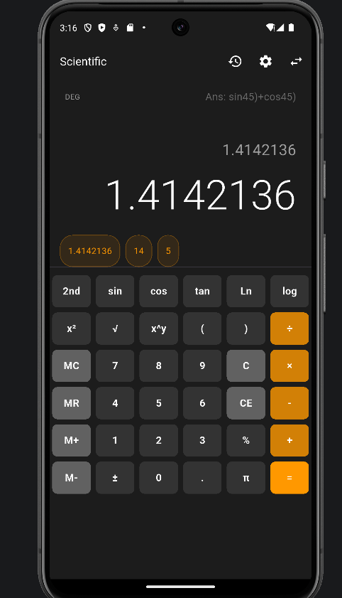
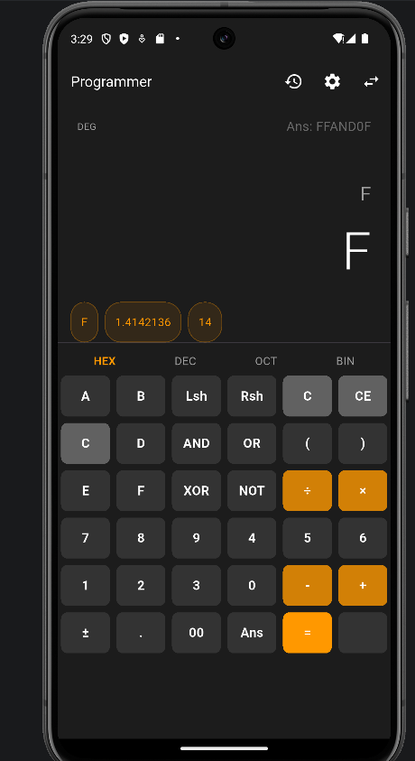

# Máy Tính Flutter Nâng Cao (Advanced Calculator)

Một ứng dụng máy tính chuyên nghiệp, đầy đủ tính năng được xây dựng bằng Flutter, hỗ trợ các chế độ Cơ bản, Khoa học và Lập trình viên.

## 🚀 Tính năng nổi bật

- **Ba chế độ hoạt động**:
  - **Cơ bản (Basic)**: Các phép tính số học hàng ngày với chức năng tính phần trăm và bộ nhớ.
  - **Khoa học (Scientific)**: Lượng giác (Sin, Cos, Tan), Logarit, Lũy thừa, Giai thừa và các hằng số Pi/e. Hỗ trợ chế độ Độ (Degree) và Radian.
  - **Lập trình viên (Programmer)**: Chuyển đổi cơ số (HEX, DEC, OCT, BIN) và các phép toán bitwise (AND, OR, XOR, NOT, Lsh, Rsh).
- **Công cụ toán học mạnh mẽ**: Bộ xử lý tùy chỉnh hỗ trợ quy tắc PEMDAS, ngoặc lồng nhau và nhân ẩn.
- **Lưu trữ dữ liệu (Persistence)**: Ghi nhớ lịch sử tính toán, tùy chọn giao diện và giá trị bộ nhớ ngay cả khi đóng ứng dụng.
- **Giao diện hiện đại (UI/UX)**:
  - Hỗ trợ giao diện Sáng (Light) và Tối (Dark).
  - Hiệu ứng hoạt họa tương tác và phản hồi xúc giác (Haptic).
  - Màn hình hiển thị đa dòng với hiệu ứng "Rung khi lỗi".
- **Cử chỉ thông minh (Gestures)**:
  - Vuốt phải trên màn hình để xóa chữ số cuối cùng.
  - Vuốt lên trên màn hình để xem nhanh lịch sử.
  - Thu phóng (Pinch) để điều chỉnh kích thước phông chữ hiển thị.

## 📸 Ảnh chụp màn hình

| Chế độ Cơ bản | Chế độ Khoa học | Chế độ Lập trình |
|------------|-----------------|-----------------|
|  |  |  |

## 🏗 Kiến trúc dự án

Dự án tuân theo kiến trúc **Clean Architecture** kết hợp với **Provider** để quản lý trạng thái:
- **Models**: Cấu trúc dữ liệu cho lịch sử và cài đặt.
- **Providers**: Quản lý trạng thái logic (Máy tính, Giao diện, Lịch sử).
- **Services**: Lưu trữ dữ liệu cục bộ bằng `shared_preferences`.
- **Utils**: Bộ máy tính toán cốt lõi.
- **Widgets**: Các thành phần giao diện có thể tái sử dụng.

Xem chi tiết tại [ARCHITECTURE.md](docs/ARCHITECTURE.md).

## 🛠 Hướng dẫn cài đặt

1. **Yêu cầu**: Đảm bảo đã cài đặt Flutter SDK và Dart.
2. **Sao chép dự án**:
   ```bash
   git clone https://github.com/HoaTruong1301/flutter_advanced_calculator_truongvinhhoa.git
   ```
3. **Cài đặt thư viện**:
   ```bash
   flutter pub get
   ```
4. **Chạy ứng dụng**:
   ```bash
   flutter run
   ```

## 🧪 Kiểm thử (Testing)

Dự án bao gồm các bài kiểm thử đơn vị (Unit Tests) toàn diện cho logic toán học.
```bash
flutter test
```
Xem chi tiết các kịch bản kiểm thử tại [TESTING.md](docs/TESTING.md).

## ⚠️ Hạn chế hiện tại

- Chưa hỗ trợ số phức trong phiên bản này.
- Giai thừa số cực lớn (n > 170) có thể trả về Infinity do giới hạn độ chính xác của số thực dấu phẩy động.

## 🔮 Cải tiến trong tương lai

- [ ] Thêm chế độ vẽ đồ thị hàm số.
- [ ] Triển khai bộ chuyển đổi tiền tệ và đơn vị.
- [ ] Hỗ trợ tính toán bằng giọng nói.
- [ ] Xuất lịch sử ra định dạng PDF/CSV.
